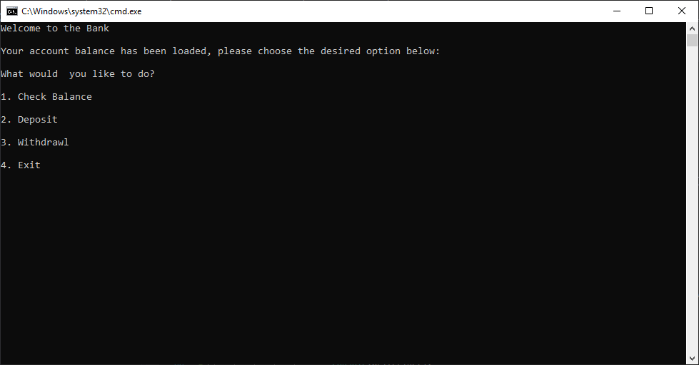
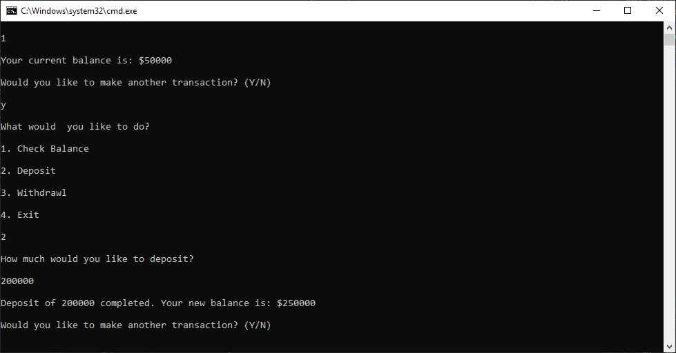
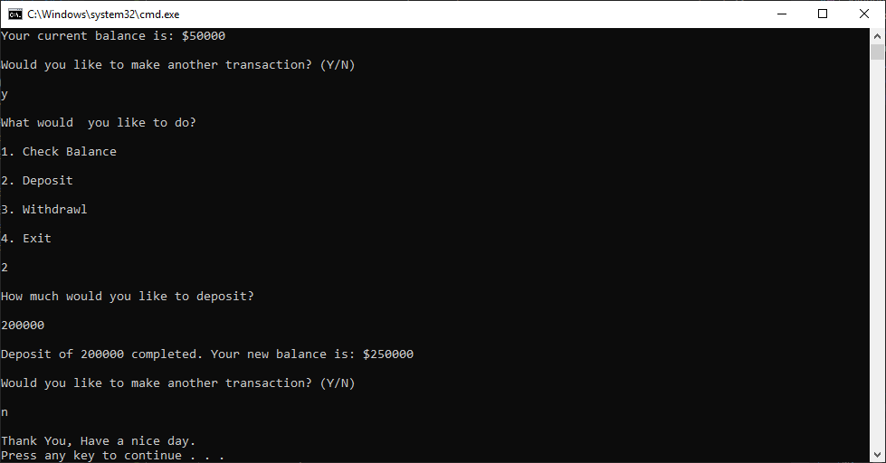

# About Me Quiz
#### Lab 02 Unit Testing
##### Author: Daniel Logerstedt

------------------------------

## Description
This is a C# application that simulates a Bank ATM. It has the ability to display balance information, deposit and withdrawl from one account. There are custom messages for handling invalid inputs and it has full unit testing.

------------------------------

## Getting Started
Clone this repository to your local machine.
```
$ git clone https://github.com/daniellogerstedt/Lab02-UnitTesting.git
```
#### To run the program from Visual Studio:
Select ```File``` -> ```Open``` -> ```Project/Solution```

Next navigate to the location you cloned the Repository.

Double click on the ```Lab02-UnitTesting``` directory.

Then select and open ```BankATM.sln```

At the top of Visual Studio select ```Debug``` -> ```Start without debugging```

------------------------------

## Visuals

##### Application Start

##### Using the Application

##### Application End


------------------------------

## Change Log
1.0 Initial release: Includes deposit, withdrawl, check balance functionality and testing.


------------------------------
